# Github Action Tutorial

## Quick Start

In our GitHub Repo Website, click "Use this template" and choose "Create a new Repository" option to create a copy of this repo of your own. Do as the image below:

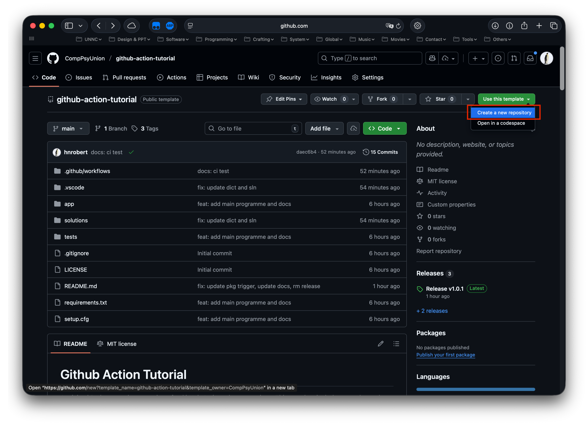

Give your new repository a name and description as you like, better make sure it is public, then click the "Create repository" button below.

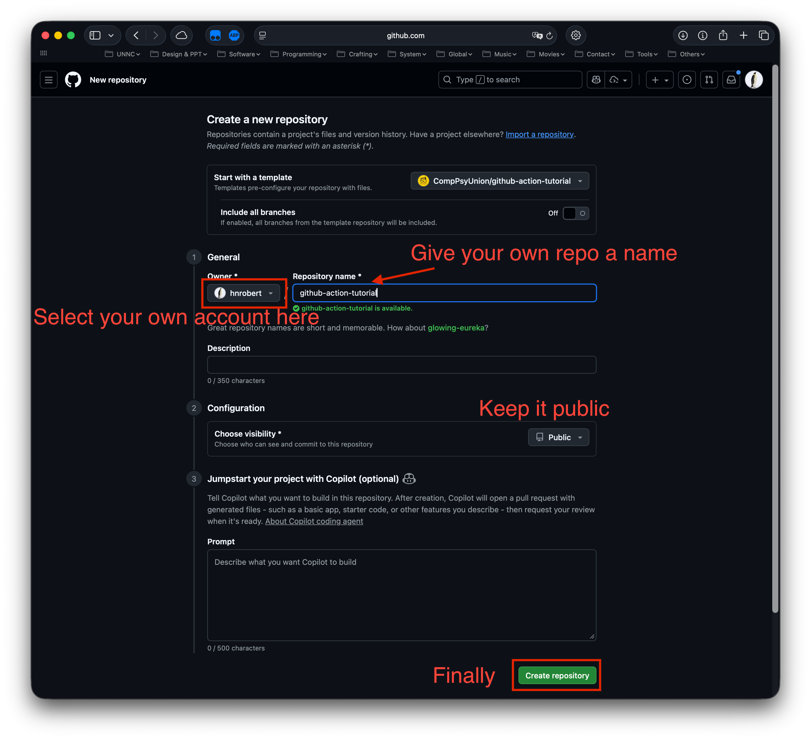

Then you will be redirected to your newly created repository. Wait a moment, and you may see your repository's web page fully displayed. Click the green "Code" button, and then choose "Codespaces" > "Create codespace on main" to start coding directly in GitHub Codespaces. Do as the image below:


Then, you can start to explore the code and workflows directly in the online environment without any local setup.

You may continue to read the rest of this README.md file in your online workspace to understand the repository structure and the workflows defined in `.github/workflows/`, and engage with us.

> If you prefer to work locally, you can also clone the repository to your local machine and keep following the instructions below.
>
> DO NOT clone the repository directly from our GitHub organisation if you want to make changes and push back to your own copy of the repository. Always create a new repository from the template first.

## Repository Overview

A minimal Python template repository for GitHub Actions demonstrations. This template includes tests (pytest) and autopep8.

Structure:

```text
.
├── LICENSE
├── README.md
├── .github
│   └── workflows
│       ├── package-matrix.yml
│       ├── package.yml
│       └── test.yml
├── .gitignore
├── app
│   ├── __init__.py
│   └── hello.py
├── assets
│   └── images
│       ├── open-in-workspace.png
│       └── workspace-structure.png
├── requirements.txt
├── solutions
│   ├── package-exercise-original.yml
│   └── package.yml
└── tests
    └── test_hello.py
```

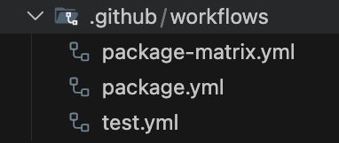

This example includes a package workflow named `package.yml`; you'll implement it as a hands-on exercise later.

## Reading a simple workflow - test.yml

### First to know: about YAML syntax


YAML is a human-friendly data serialization standard for all programming languages. It is commonly used for configuration files and in applications where data is being stored or transmitted. Github Actions workflow files are written in YAML format (\*.yml files).

To store and let GitHub Actions know how to run your workflows, you need to understand some basic YAML syntax first. Here are some key points to get you started quickly:

- Key-Value Pairs: Data is represented as key-value pairs, separated by a colon and a space (`key: value`).

  ```yaml
  name: CI — Test & Lint
  ```

  > PS: In YAML, strings do not need to be enclosed in quotes unless they contain special characters.  
  > For example, all of the following four lines are valid in YAML:
  >
  > ```yaml
  > greeting: Hello
  > greeting: Hello World
  > greeting: "Hello World"
  > path: "/home/user/my folder"
  > ```
  >
  > Here, `greeting` does not need quotes, but `path` uses quotes because the value contains a space.  
  > So THIS is NOT valid:
  >
  > ```yaml
  > path: /home/user/my folder # ❌
  > ```

- Indentation: YAML uses indentation (spaces) to denote structure. Consistent indentation is crucial; typically, two spaces are used per level.
- Nested Structures: Indentation indicates nesting. For example:

  ```yaml
  on:
    push:
    pull_request:
  ```

- Lists: List items are denoted by a hyphen and a space (`- item`). It can also be defined in-line using square brackets (`[item1, item2]`).

  ```yaml
  branches:
    - main
    - develop
  ```

  **Or the following expression, they are equivalent**

  ```yaml
  branches: [main, develop]
  ```

  Within a list, each item can be a simple value or a complex structure (like another key-value pair).

  ```yaml
  steps:
    - name: Checkout Repo
      uses: actions/checkout@v4
    - name: Run tests
      run: pytest -q
  ```

  If we convert the above to JSON, it would look like this:

  ```json
  "steps": [
    {
      "name": "Checkout Repo",
      "uses": "actions/checkout@v4"
    },
    {
      "name": "Run tests",
      "run": "pytest -q"
    }
  ]
  ```

- Comments: Lines starting with `#` are comments and are ignored by parsers.

  ```yaml
  # This is a comment. It looks awesome.
  # It is a good habit to add comments in your GitHub Actions workflow files
  ```

**Congrats!** You now have a basic understanding of YAML syntax, which is enough for you to read and understand GitHub Actions workflow files.

### Breakdown of test.yml - Understanding a simple CI workflow

Let's break down the `test.yml` workflow file located in `.github/workflows/test.yml`.

#### Workflow Name and Trigger

- `name`: This defines **the name of the workflow** as it will appear in the GitHub Actions interface. In this case, it's named "CI — Test & Lint".

  ```yaml
  name: CI — Test & Lint
  ```

  

  > PS: Never mind about the error shown in your Actions tab if you haven't set up anything yet; it will go away once you implement the workflow correctly.

- `on`: This section defines **when the workflow will run**. It triggers on pushes and pull requests to the `main` branch.

  ```yaml
  on:
    push:
      branches: [main]
    pull_request:
      branches: [main]
  ```

`push` events occur when code (new commits / updates to previous commits) is pushed to the repository, while `pull_request` events happen when a pull request is opened or updated.

To use a `pull_request` trigger, you typically need to fork the repository, make changes in your fork, and then create a pull request back to the original repository.  
The owner of the original repository can then review and merge your changes based on the results of the workflow triggered by the pull request.

There are many other events that can trigger workflows, such as `release`, `schedule`, `workflow_dispatch` (manual trigger), etc. You can find more details in [the official GitHub documentation](https://docs.github.com/en/actions/using-workflows/events-that-trigger-workflows).

#### Jobs

Now let's look at the job definition:

```yaml
jobs:
  test:
    runs-on: ubuntu-latest
    steps:
      # Checkout the repository - Add this step at the beginning of the steps to help the Job access the code
      - name: Checkout Repo
        uses: actions/checkout@v4

      # ...
```

This section defines a job named `test` that runs on the latest Ubuntu environment.

To define a job in GitHub Actions, you use the `jobs` keyword followed by a unique identifier for the job (in this case, `test`). Each job can have several properties, including:

- `runs-on`: Specifies the type of virtual machine to run the job on (e.g., `ubuntu-latest`, `windows-latest`, `macos-latest`).
  - GitHub Actions provides a variety of hosted runners with different operating systems and configurations. The three most common options are:
    - `ubuntu-latest`: The latest stable version of Ubuntu Linux.
    - `windows-latest`: The latest stable version of Windows Server.
    - `macos-latest`: The latest stable version of macOS.
    - You can choose a appropriate runner according to [the docs provided by GitHub](https://docs.github.com/en/actions/how-tos/write-workflows/choose-where-workflows-run/choose-the-runner-for-a-job#choosing-github-hosted-runners) based on your project's requirements and the environment you need for your workflows.
  - You can also set up self-hosted runners if you need specific hardware or software configurations not available in GitHub's hosted runners.
- `steps`: A list of steps that make up the job. Each step can either run a script or use an action.

There are many other properties you can define for jobs, such as `needs` (to specify job dependencies), `strategy` (for matrix builds), and more. You can find more details in [the official GitHub documentation](https://docs.github.com/en/actions/using-jobs/defining-jobs-in-a-workflow).

#### Steps

The `steps` section contains a series of actions that the job will perform.

The following is the complete `steps` section with comments explaining each step

```yaml
steps:
  # Checkout the repository - Add this step at the beginning of the steps to help the Job access the code
  # This is a common first step in most workflows that need to work with the repository's code.
  - name: Checkout Repo
    uses: actions/checkout@v4

  # Set up Python environment - Automatically install Python for the job efficiently
  # In this way, you don't need to manually install Python using shell commands
  # This action step handles it for you.
  - name: Set up Python
    uses: actions/setup-python@v4
    with:
      python-version: '3.11'

  # Install dependencies
  # This step ensures that all necessary Python packages listed in requirements.txt are installed
  - name: Install dependencies
    run: |
      python -m pip install --upgrade pip
      pip install -r requirements.txt

  # Run linting - Check code style using autopep8
  # This is a common practice to maintain code quality and consistency.
  - name: Run autopep8 check
    run: |
      pip install autopep8
      autopep8 --diff --recursive app tests

  # Run tests - Execute the test suite using pytest.
  # If everything passes, the step will succeed, the job will succeed,
  # else they will all fail eventually and issues will be reported.
  - name: Run tests
    env:
      PYTHONPATH: ${{ github.workspace }}
    run: pytest -q
```

## Add packaging workflow (exercise)

### How to package this project locally (for reference)

You can quickly build a standalone executable for this small project with PyInstaller.

> It is not necessary for you to run this locally, as the packaging step today will be done in GitHub Actions, but if you want to try it out, follow these steps.

On macOS/Linux:

```bash
python3 -m venv .venv
source .venv/bin/activate  # macOS/Linux
.venv/bin/pip install -r requirements.txt
.venv/bin/pyinstaller --onefile app/hello.py
ls -la dist
```

On Windows PowerShell:

```powershell
python -m venv .venv
.\.venv\Scripts\Activate.ps1
.venv\Scripts\pip.exe install -r requirements.txt
.venv\Scripts\pyinstaller.exe --onefile app/hello.py
dir dist
```

### Implement packaging workflow in GitHub Actions

Now you can try implement a simple sequential workflow that first builds macOS arm64 and then Windows x64 packages in `.github/workflows/package.yml` in your codespace.

If you have finished composing or encountered some troubles, you may see `solutions/package.yml` — this builds the two packages in sequence and uploads two artifacts (`hello-macos-arm64` and `hello-windows-x64`). Do NOT open it until you have tried your best to implement it on your own.

You can now test your workflow by committing and pushing your changes to the `main` branch of your repository, or you can manually trigger the workflow from the "Actions" tab in your repository.

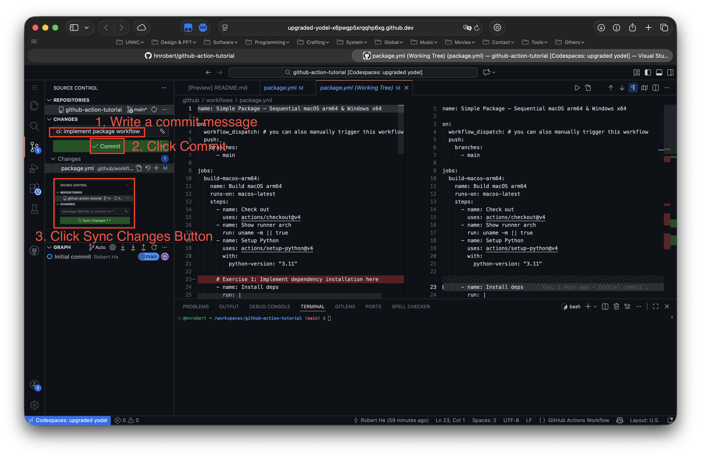

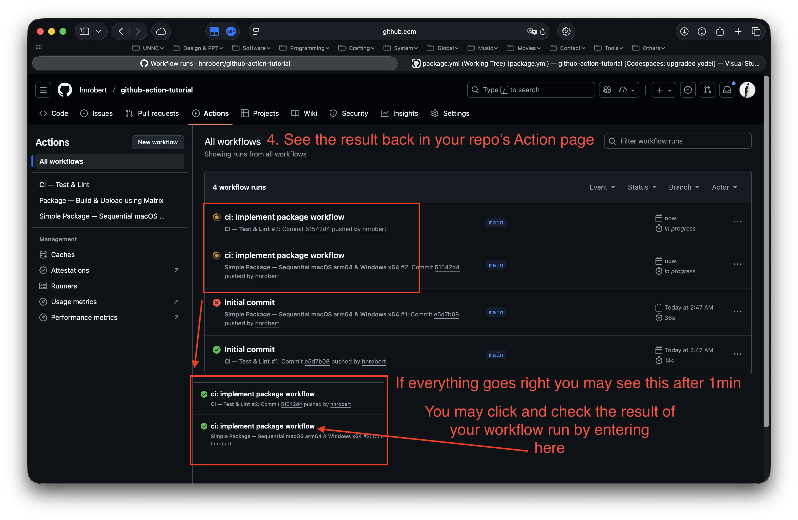

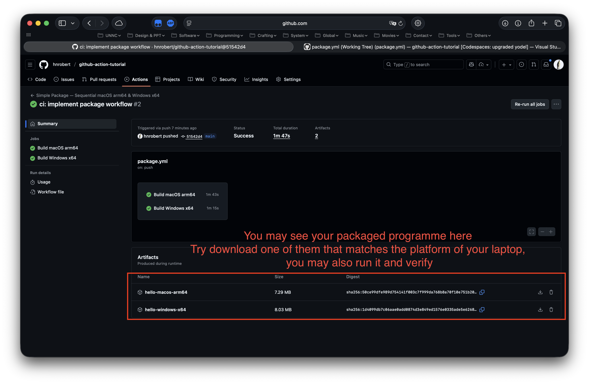

## Release flow (automatic packaging and upload assets to release)

The repository includes a workflow that automatically builds packages for multiple OS/Python combinations and attaches the build artifacts to a GitHub Release.

- `package-matrix.yml` — runs packaging on `ubuntu`, `macos`, and `windows` using a matrix and attaches the build artifacts to the release when the workflow is triggered by the `release` event.

### Wait, your workflow need some permissions to upload assets to release

To allow the workflow to upload assets to a release, you need to grant it the necessary permissions. By default, GitHub Actions workflows have read-only access to the repository contents. To upload assets to a release, you need to ensure that the workflow has write permissions.

#### How to do that

1. Go to your repository on GitHub.
2. Click on the "Settings" tab.
   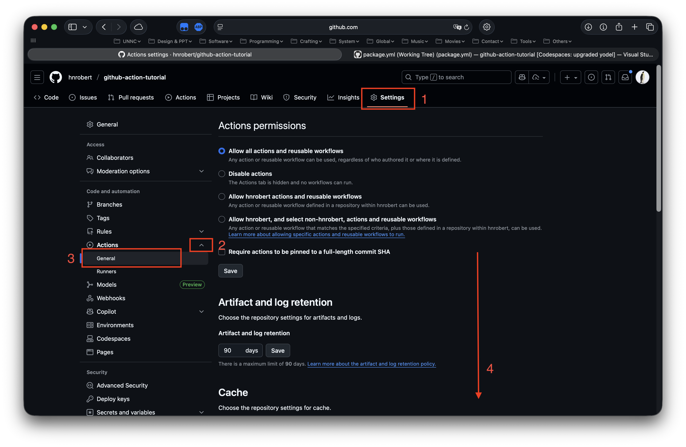
3. In the left sidebar, click on "Actions" > "General" under the "Security" section.
4. Scroll down to the "Workflow permissions" section.
5. Select the option "Read and write permissions".
   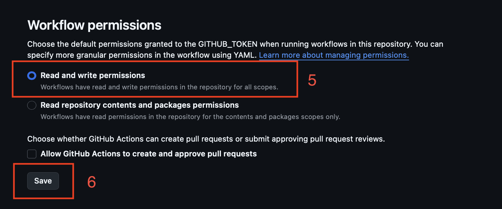
6. Click the "Save" button to apply the changes.

### Now try to create a release

1. Go back to home page of your repo.
   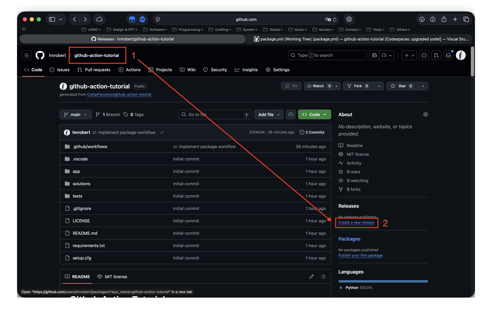
2. Enter a tag version (e.g., `v1.0.0`) and fill in the release title and description you like.
   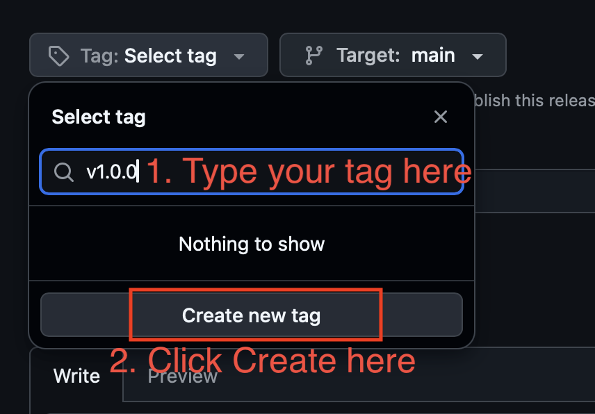  
   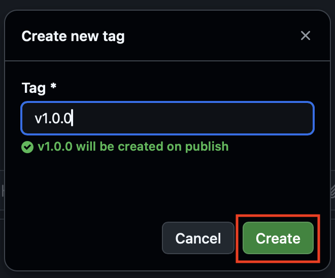  
   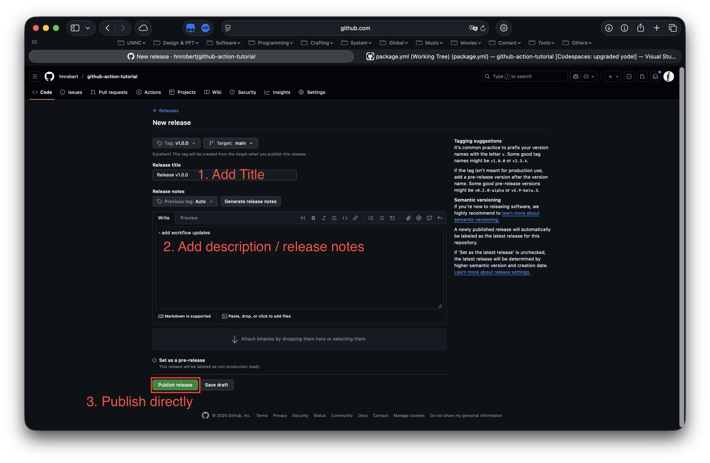
3. Click on "Publish release".

Once the release is published, the `package-matrix.yml` workflow will automatically run (so do the workflow defined by `package.yml` that you have just implemented, but now let's focus on `package-matrix.yml`), building the packages for each OS/Python combination defined in the matrix and attaching the resulting artifacts to the release.

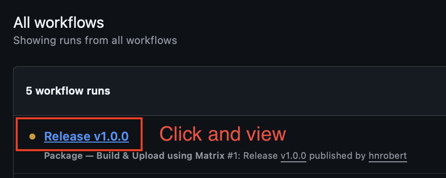

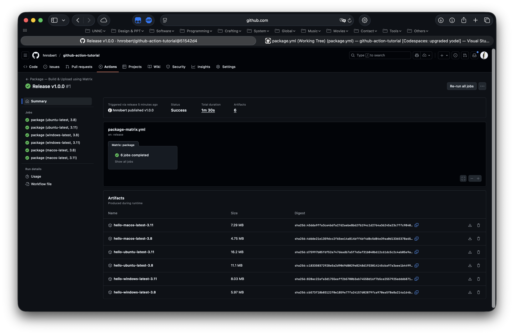

Going back to the release page after the workflow succeeded, as you can see, the workflow has successfully built and attached multiple artifacts to the release.

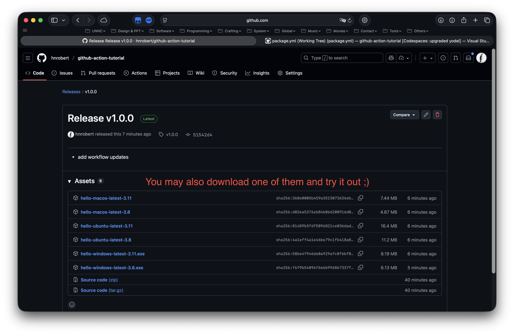

## The end

Now you may return to our [Weekly Sharing Session Repo](https://github.com/CompPsyUnion/2526-weekly-session/tree/main/Contents/GitHubAction) and continue to the end of our today's session.
